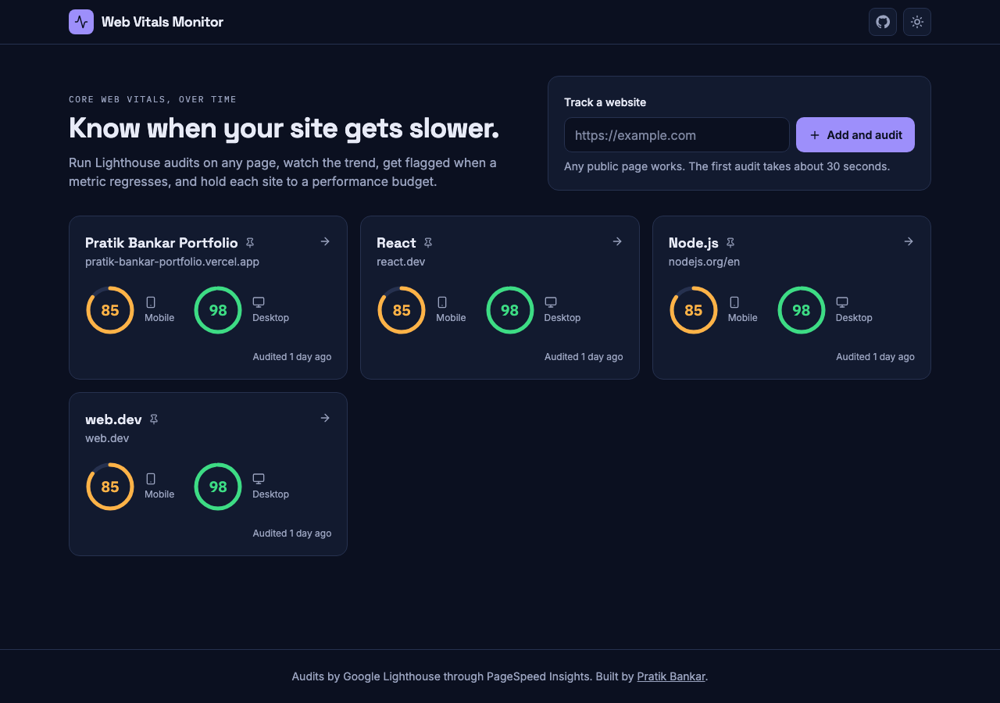
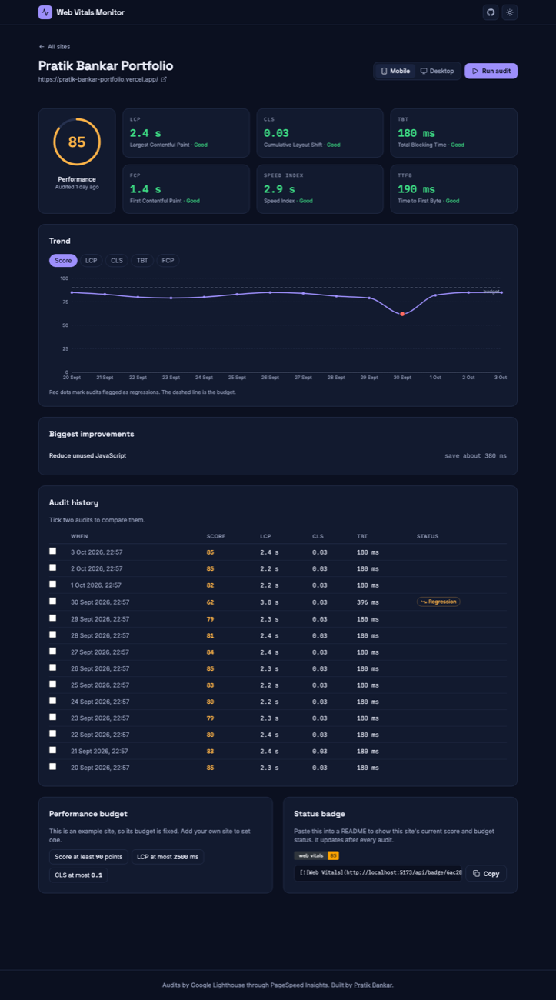

# Web Vitals Monitor

Track the Core Web Vitals of any website over time. Run Lighthouse audits, see the trend, get
flagged when a metric regresses, hold each site to a performance budget, and embed a live
status badge in your README.

**Live demo:** https://web-vitals-monitor-pratik.vercel.app



## What it does

- **Audits on demand and every day.** Add a URL and it is audited on mobile and desktop with
  Google Lighthouse (through the PageSpeed Insights API). A daily job re-audits every site.
- **Trends.** Performance score, LCP, CLS, TBT and FCP charted over time.
- **Regression detection.** Each audit is compared with the median of the previous five. A
  meaningful slowdown is flagged and explained ("LCP went from a usual 2.0 s to 2.9 s").
- **Performance budgets.** Set limits per site (score at least 90, LCP at most 2.5 s) and see
  pass or fail on every audit.
- **Status badge.** An SVG badge per site showing the current score and budget status.
- **Compare two audits** side by side, and see Lighthouse's biggest improvement suggestions.
- **Real-user data** from the Chrome UX Report, when Google has it for the page.



## How regression detection works

Lighthouse scores vary from run to run, so comparing with only the previous audit produces
false alarms. Instead:

- The baseline is the **median of the previous five audits** for the same device type. One
  unusually slow audit cannot hide or invent a regression.
- At least three earlier audits are needed before anything is flagged.
- The score must drop by 10 points or more.
- A timing metric (LCP, FCP, TBT) must be worse by 20 percent **and** by a minimum absolute
  amount (300 ms, or 100 ms for TBT), so fast pages do not flap over a few milliseconds.
- CLS must worsen by 0.05 or more.

The rules are pure functions in [`server/lib/rules.ts`](server/lib/rules.ts) with tests in
[`tests/server/rules.test.ts`](tests/server/rules.test.ts).

## Tech stack

| Layer | Tools |
|---|---|
| Client | React 19, TypeScript, Vite, Tailwind CSS, Recharts, React Router |
| Server | Node.js, Express, TypeScript, Mongoose, Zod |
| Data | MongoDB |
| Audits | Google PageSpeed Insights API v5 (Lighthouse) |
| Tests | Vitest, Supertest, in-memory MongoDB |
| Hosting | Vercel (static client, one serverless function, daily cron) |

## Run it locally

Needs Node.js 20 or newer. Nothing else: with no configuration the app uses an in-memory
database with two weeks of sample history, and audits return sample data.

```bash
npm install
npm run dev        # client on http://localhost:5173, API on http://localhost:4000
```

For real audits and persistent data, copy `.env.example` to `.env` and set `PSI_API_KEY`
(a free Google API key) and `MONGODB_URI`.

| Command | What it does |
|---|---|
| `npm run dev` | Client and API with reload |
| `npm test` | All tests |
| `npm run typecheck` | Type check client and server |
| `npm run lint` | ESLint |
| `npm run build` | Production build of the client |
| `npm run seed` | Add the example sites to the configured database |

## API

| Method and path | Purpose |
|---|---|
| `GET /api/sites` | Tracked sites with their latest audit per device |
| `POST /api/sites` `{ url, name? }` | Track a site (public http or https pages only) |
| `GET /api/sites/:id` | A site and its audit history |
| `POST /api/sites/:id/audit` `{ strategy }` | Audit now (`mobile` or `desktop`) |
| `PUT /api/sites/:id/budget` | Set the performance budget |
| `DELETE /api/sites/:id` | Remove a site (needs `x-admin-key`) |
| `GET /api/badge/:id.svg` | Status badge (`?strategy=desktop` for desktop) |

Errors always look like `{ "error": { "code": "...", "message": "..." } }`.

## Project layout

```
src/                React client
  pages/            Dashboard and site page
  components/       Score ring, trend chart, budget editor, badge snippet
  lib/              API client, formatting and rating helpers
server/             Express API
  lib/              Pure rules: audit parsing, regressions, budgets, badge, URL validation
  app.ts            Routes
  audit.ts          Runs and stores one audit
api/index.ts        Vercel function entry
tests/              Server and client tests
docs/superpowers/   Design spec and implementation plan
```

## Design notes

- **The server never fetches a submitted URL.** It only passes the address to Google, which
  removes server-side request forgery as a risk. Private and local addresses are rejected anyway.
- **The public demo has no accounts**, so it is protected by limits instead: at most 12 sites,
  one audit per site and device every 5 minutes, and per-visitor rate limits. Example sites
  are pinned and cannot be changed without an admin key.
- **A failed audit stores nothing.** Quota errors, timeouts and unreachable pages return a
  readable message and the visitor can retry.
- **Badges never break.** An unknown site or a site without audits gets a valid "no data" badge.

## License

MIT
